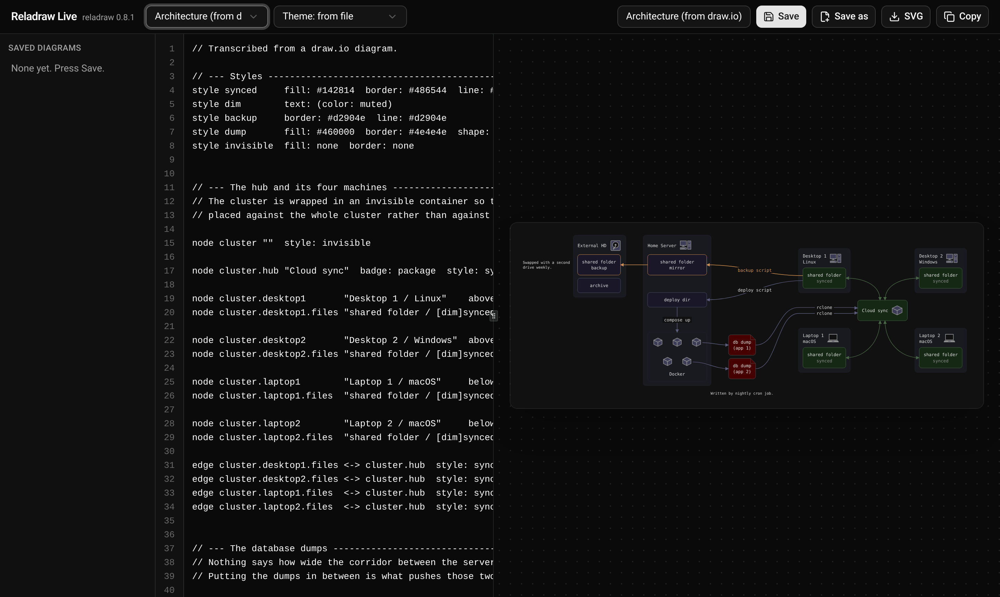

# Reladraw Live

A one-screen playground for [reladraw](https://github.com/reladraw/reladraw) (pinned `0.8.1`), a diagram language where you say where things go. Type on the left, the SVG renders live on the right, and diagrams save to a local SQLite file.



## Run

```sh
bun install && bun run dev    # http://localhost:3000  (PORT=... to change)
```

## Features

- Live preview (debounced ~150 ms), compiled in the browser with `reladraw.compile()`.
- Inline errors: `line N: message` under the editor, offending line highlighted, last good render kept (dimmed).
- Example picker (6 examples, 5 adapted from reladraw's `examples/` at v0.8.1, Apache-2.0).
- Theme override for all 13 built-in themes ("from file" respects `diagram theme:`).
- Download SVG, copy source.
- Save / Save as / open / delete named diagrams (`bun:sqlite`, `data/diagrams.sqlite`, gitignored). `Ctrl/Cmd+S` saves; the last-opened diagram is restored on reload.

## Scripts

| Script | What |
| --- | --- |
| `bun run dev` | Dev server with HMR |
| `bun test` | Tests for the compile wrapper and the diagram store |
| `bun run check` | Prettier check + `tsc --noEmit` (also the pre-commit hook) |
| `bun run format` | Prettier write |

## Layout

```
src/index.ts                  Bun.serve: HTML import + /api/diagrams routes
src/App.tsx                   The one screen
src/features/editor/          compile.ts (+test), useCompile.ts, Editor.tsx
src/features/preview/         Preview.tsx, download.ts
src/features/examples/        examples.ts, files/*.ts
src/features/diagrams/        store.ts (+test), routes.ts, api.ts, DiagramList.tsx
src/components/ui/            shadcn/ui (button, input, select, sonner, resizable)
```

## Build notes / deviations from PLAN.md

- `bunfig.toml` excludes only `reladraw` from `minimumReleaseAge` (0.8.1 was published 2026-09-27; approved exception).
- `bunx shadcn@latest init` can't detect Bun's fullstack template ("could not detect a supported framework"), so shadcn was configured manually per its manual-install docs (the `components.json` + `styles/globals.css` that `bun init --react=shadcn` ships), then components were added with `bunx shadcn@latest add`.
- The shadcn CLI resolved the `cn` import to an unrelated npm package named `cn`; imports were fixed to `@/lib/utils` and that package removed. `next-themes` was dropped from `sonner.tsx` (the app is dark-only).
- Examples are TS string modules rather than `.reladraw` text imports, because Bun's HMR turned `with { type: "text" }` imports into asset URLs after a reload.
- Last-opened diagram id is kept in `localStorage`; diagrams themselves live in SQLite.
